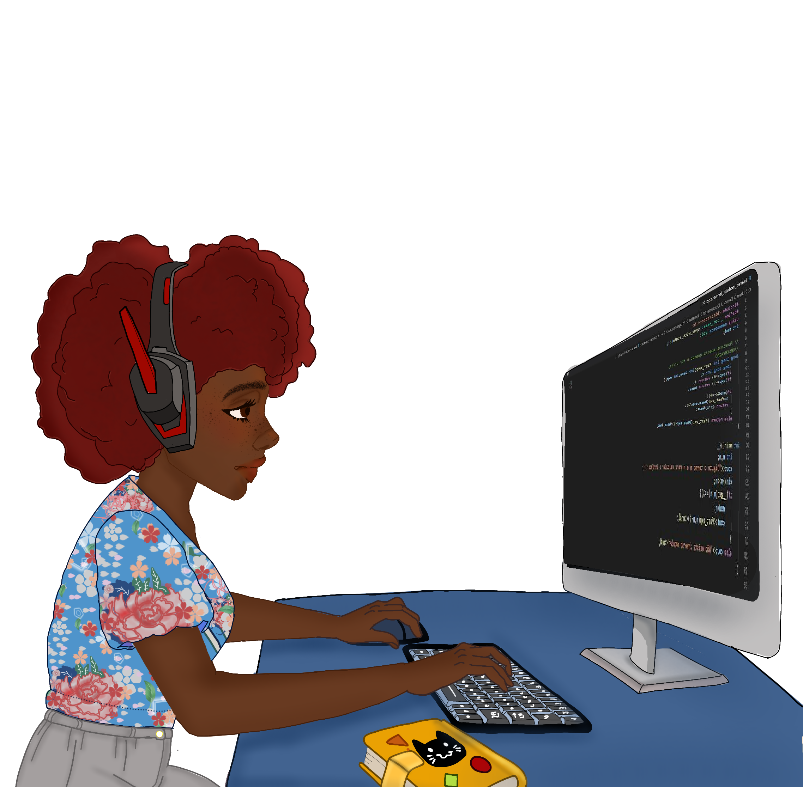

<h1 align="left">
Hello Devs! 👋
</h3>

<h2>
Sejam bem vindos ao meu perfil GitHub!
</h2>

 
 
  
 

Tenho 19 anos, moro em Olinda-PE, vinda da área de saúde(enfermagem), decidi fazer uma  transição de carreira para a área de tecnologia,troquei curativos por aplicativos. Sou iniciante no mundo da programação mas estou cada vez mais apaixonada por tudo isso!❣️

 

 

<h3>
🖥️ Tecnologias e Ferramentas:
</h3>

            
            
           
           

 
<ul>
<li>👩🏾‍💻 Dev em formação;</li>

<li>📚 Tenho estudado Java;</li>

<a href="https://www.linkedin.com/in/bianca-britto-853529204"> 
<a/>

          

 
